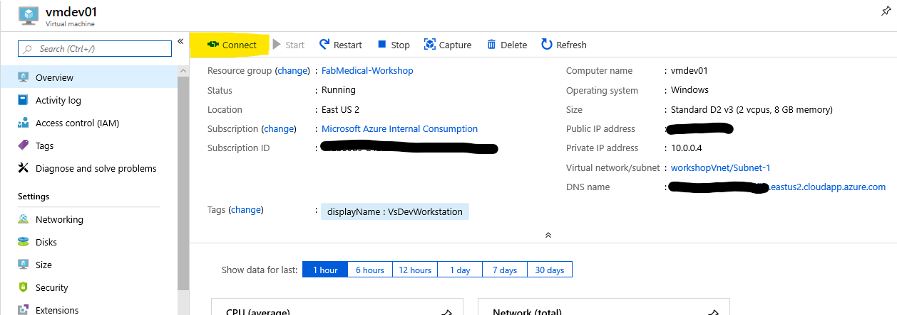
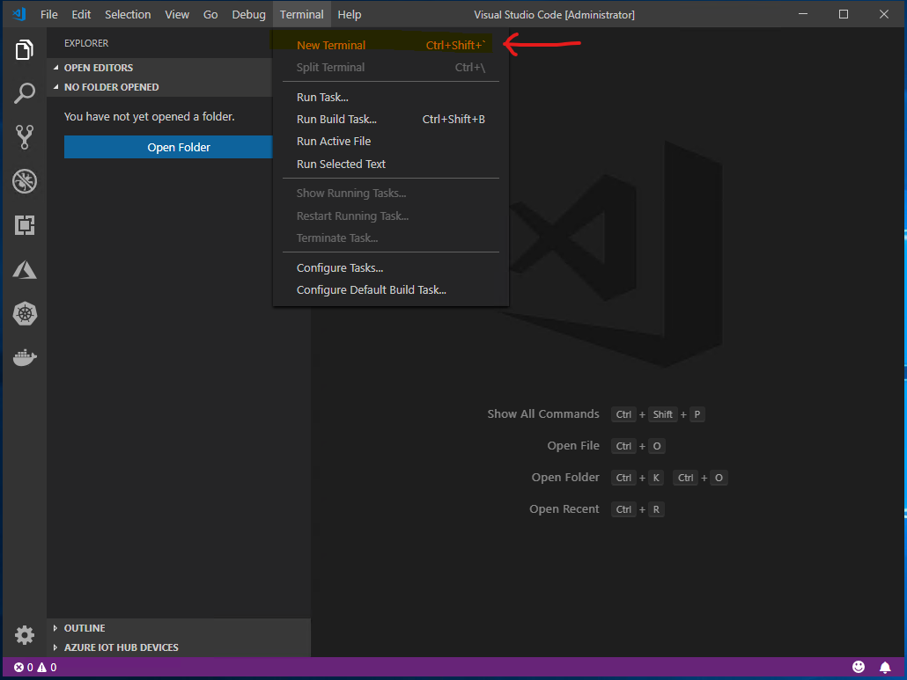
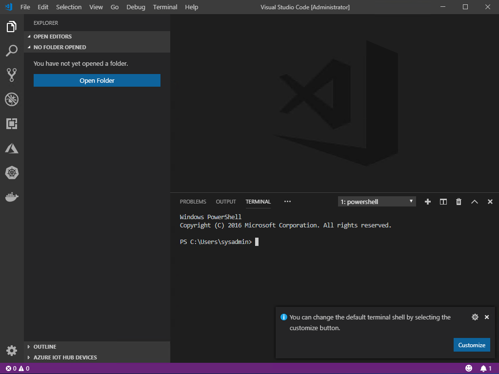
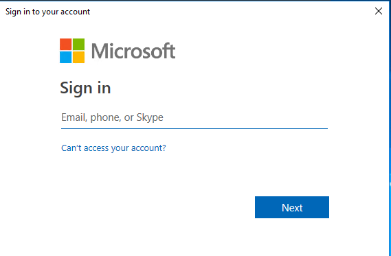
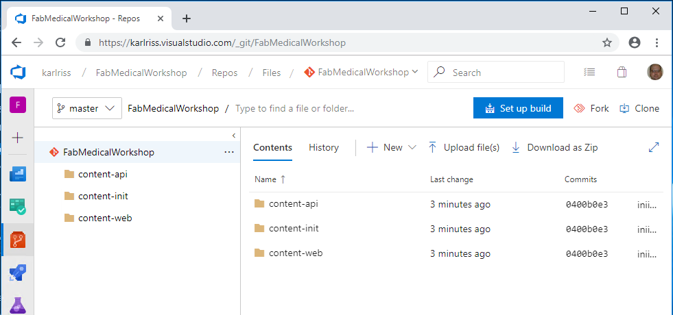

Containers and DevOps

Before the hands-on lab setup guide

March 2019

Information in this document, including URL and other Internet Web site references, is subject to change without notice. Unless otherwise noted, the example companies, organizations, products, domain names, e-mail addresses, logos, people, places, and events depicted herein are fictitious, and no association with any real company, organization, product, domain name, e-mail address, logo, person, place or event is intended or should be inferred. Complying with all applicable copyright laws is the responsibility of the user. Without limiting the rights under copyright, no part of this document may be reproduced, stored in or introduced into a retrieval system, or transmitted in any form or by any means (electronic, mechanical, photocopying, recording, or otherwise), or for any purpose, without the express written permission of Microsoft Corporation.

Microsoft may have patents, patent applications, trademarks, copyrights, or other intellectual property rights covering subject matter in this document. Except as expressly provided in any written license agreement from Microsoft, the furnishing of this document does not give you any license to these patents, trademarks, copyrights, or other intellectual property.

The names of manufacturers, products, or URLs are provided for informational purposes only and Microsoft makes no representations and warranties, either expressed, implied, or statutory, regarding these manufacturers or the use of the products with any Microsoft technologies. The inclusion of a manufacturer or product does not imply endorsement of Microsoft of the manufacturer or product. Links may be provided to third party sites. Such sites are not under the control of Microsoft and Microsoft is not responsible for the contents of any linked site or any link contained in a linked site, or any changes or updates to such sites. Microsoft is not responsible for webcasting or any other form of transmission received from any linked site. Microsoft is providing these links to you only as a convenience, and the inclusion of any link does not imply endorsement of Microsoft of the site or the products contained therein.

© 2018 Microsoft Corporation. All rights reserved.

**Contents**
<!-- TOC -->

- [Containers and DevOps before the hands-on lab setup guide](#containers-and-devops-before-the-hands-on-lab-setup-guide)
  - [Requirements](#requirements)
  - [Before the hands-on lab](#before-the-hands-on-lab)
    - [Task 1: Prepare your development environment](#task-1-prepare-your-development-environment)
    - [Task 2: Configure your dev environment](#task-2-configure-your-dev-environment)
    - [Task 3: Validate your environment (Optional, everything should be good)](#task-3-validate-your-environment-optional-everything-should-be-good)
    - [Task 4: Setup your Azure DevOps Project](#task-4-setup-your-azure-devops-project)
    - [Task 5: Create Azure Resources needed for the lab](#task-5-create-azure-resources-needed-for-the-lab)

<!-- /TOC -->

# Containers and DevOps before the hands-on lab setup guide

## Requirements

1.  Microsoft Azure subscription must be pay-as-you-go or MSDN.

    - Trial subscriptions will *not* work.

    - You must have rights to create a service principal as discussed in Task 9: Create a Service Principal --- and this typically requires a subscription owner to log in. You may have to ask another subscription owner to login to the portal and execute that step ahead of time if you do not have the rights.

    - You must have enough cores available in your subscription to create the build agent and Azure Kurbernetes Service cluster in Task 5: Create a build agent VM and Task 10: Create an Azure Kubernetes Service cluster. You'll need eight cores if following the exact instructions in the lab, more if you choose additional agents or larger VM sizes. If you execute the steps required before the lab, you will be able to see if you need to request more cores in your sub.

2. A VisualStudio.com account.

3. Local machine or a virtual machine configured with:

    - A browser, preferably Chrome for consistency with the lab implementation tests.

    - Command prompt.

         i.  On Windows, you will be using PowerShell.

         ii. On Mac, all instructions should be executed using bash in Terminal.

4. You will be asked to install other tools throughout the exercises.

## Before the hands-on lab

**Duration**: 30min

You should follow all of the steps provided in this section *before* taking part in the hands-on lab ahead of time as some of these steps take time.

### Task 1: Prepare your development environment

You will deploy the development workstation to your azure subscription.  This will create the resource group you will use throughout this lab as well as your development VM.  The ARM template performs the following;
- Creates a virtual network
- Creates a virtual machine
- Installs Hyper-V on the VM
- Installs Docker-Desktop on the VM

> **Note: Setting up the development machine is optional.  You can isntall the development tools onto your local Windows, MacOSX, or Linux development workstation.**
> 
> **You can find instructions and scripts [here](/Local Machine Setup.md).  When done, skip to Task 4**

1.  Click the "deploy to Azure" Button.  This will take you to the Azure Portal, log you in, and show you the custom template deployment screen prompting you for deployment parameters.  **NOTE:** The default user name is "sysadmin" and the default password is "Password$123".

2.  For the **Resource Group**, select to Create New and enter something like "fabmedical-SUFFIX".

    

3.  Check the **I agree to the terms and conditions stated above** checkbox and then click the **Purchase** button.  Deploying the VM should take about 15 minutes.  This is a good time to start reviewing the Hands-on lab step by step documentation.

    

4. Sit back and wait.  It will take about 15-20min to deploy and configure the development environment.  You can monitor the process via the notifications menu option at the top right of the azure portal.

     

    You can get more detail about the deployment by clicking the Deployment Process link.

    

    When your deployment is complete, you can click the link to the resource group to review the services that have been created and remote into your new dev workstation.

    
    
>**Note: If you plan on using this workstation for an extended period of time, it is recomended that you turn on [just in time access](https://docs.microsoft.com/en-us/azure/security-center/security-center-just-in-time) to your VM and setup an [auto shutdown policy](https://azure.microsoft.com/en-us/blog/announcing-auto-shutdown-for-vms-using-azure-resource-manager/)**

### Task 2: Configure your dev environment

Your development VM is almost ready.  Once you login for the first time, a script will run that will complete the process.  The script will configure the following;
- Install Goggle Chrome
- Install Postman
- Install Azure CLI
- Install Kubernetes CLI
- Install Helm CLI
- Install Visual Studio Code and add several extensions
- Kick off Docker-Desktop
The script should take about 5 minutes to complete.
> 

1.  From the Azure Portal, select the resource group you created when you deployed the template in Task 1 and click on vmdev01.

    

2.  Click connect, download the RDP file, and open the RDP file.
    
    

    

3.  Enter the user name and password you used when you deployed the template.  **Note: choose 'Use a different account' and enter '.\sysadmin' as the user and 'Password$123' as the password if you kept the defaults**

    

    Select 'Yes' on the Remote Desktop Connection Dialog.

    

4.  Once you login, a script will kick off which will install additional tools.

    

5.  When the script is finished, after about 5min, it will launch Docker-Desktop and copy a script to your desktop.  
    >**Note: The script on your desktop can be used if you need to reinstall some of the tools.**  

    Click "OK" in the Docker Desktop dialog that stats support is depricated.  This will start docker on the development machine.

    

    

6. After about 5min You will be prompted to login to Docker.  If you don't have a docker account and don't want to create one, you can simply close the dialog.  Docker is now up and running.
    
    

### Task 3: Validate your environment (Optional, everything should be good)

We are going to run a couple of tests to make sure your environment is setup correctly.  We are going to;
- Open Visual Studio Code
- Open a PowerShell Terminal Window
- Verify we can run a docker container
- Verify we have various command line tools installed and running

1. Verify you have Google Chrome, Setup_tools, Visual studio Code, and Postman installed by noting the shortcuts have been placed on your desktop.

    

2. Open Visual Studio Code (the blue icon) and verify extensions are installed.
     >**Note: VSCode will open a browser window which will prompt you to choose your default browser, select Chrome and click OK.**

     

     Next, verify VSCode is showing the three icons highlighted below.  These represent your Azure, Kubernetes, and Docker extensions.

     

3. Open a terminal window in VSCode and configure PowerShell as your default terminal
   
   

   

4. Test docker by entering 'docker run hello-world' in the terminal window.  You should see the message "Hello from Docker!"
   
   

   Next click on the Docker extension in visual studio code and expand the images node and the containers node to verify the extension is working.  You should see the hello-world container and a stopped container instance.

   

5. Enter 'az' in the terminal window to verify the azure command line tool.  You should see help information as a response.
   
   

6. Enter 'kubectl' in the terminal window to verify the kubernetes command line tool.  You should see help information as a response.
   
   

7. Enter 'helm' in the terminal window to verify the helm command line tool.  You should see help information as a response.
   
   

### Task 4: Setup your Azure DevOps Project
This task will walk you through creating a new Azure DevOps project and uploading the FabMedical starter files.

>**Note: If you do not yet have an Azure DevOps project, it is easy and free to sign up.  Azure DevOps is free to use for teams of up to 5 users and for open source projects, free for an unlimited number of users.  To Create a new tenant, go to visualstudio.com, login, and create your new organization.**

**NOTE: if you already have and use an Azure DevOps tennant, you can skip to step 4d and use it as long as you have the ability to create new projects and build/release pipelines.**

1. go to visualstudio.com and login.
   
    

2. create new project.
    
    

    Enter FabMedicalWorkshop for your project name and then click 'Create'.

    

    

3. To upload the FabMedical starter files to the repo, we need to initialize the local repo, add the changes, connect to the remote repository, and then push our code.

    Open file explorer and navigate to C:\Source.  Right click the FabMedical directory and select to 'Open with Code'.

    

    In visual studio code, open a new terminal window.

    

    In the terminal window, you will enter the following commands

    `git init`

    

    `git config --global user.email "youremail@yourcompany.com"`

    `git config --global user.name "yourname"`

    

    `git add --all`

    

    `git commit -m "initial commit" --all`

    

    Go back to Azure DevOps and click on the repo icon in the left menu to retrieve the commands necessary to connect your local repo to your azure DevOps repo and push your files to Azure DevOps.  The commands you need to copy are highlighted.

    

    

    Go back to visual studio code and past the commands into the terminal window and hit enter.  This will connect your local repo to azure devOps and start to push your files..

    

    You will be asked to login before you can push files to the remote server.

    

    After logging in, the files should start uploading.

    

    Going back to Azure DevOps and refreshing the page will show the files you just uploaded.

    

4. Connect Visual Studio Code to Azure DevOps (Optional).  This will provide more information about bugs, work items, and builds withing your Visual Studio Code environment.

    Click the 'Team' Icon in the lower left.

    

    Select to 'Authenticate and get and access token automatically'.

    

    Copy the token and then hit enter.

    

    Paste your token into the Device Login Page and click continue to authenticate.

    

    When done, you will see additional information in the lower left of Visual Studio Code relating to Azure DevOps.

    

### Task 5: Create Azure Resources needed for the lab

The lab uses several Azure services.  In this task we will use the Azure CLI to deploy the services into the resource group you created in step 1.  We will create the following in your Azure subscription;
- Azure Service Principle
- Azure Container Registry
- Azure Kubernetes Cluster
- Azure CosmosDB

>**Note: All of these resources could have been provisioned with the development workstation.  It was a choice to have you manually provision the resources to gain exposure to the Azure CLI.**

1. Open Visual Studio Code and Open a PowerShell terminal window.
   
    

    

2. Login to your azure subscription with the Azure CLI.

    
    
    

3. (Optional) If you are using your local development workstation, you will need to create a resourcegroup 
   `az group create --name <myresourcegroupname>`
   

4. Create an Azure Container Registry by executing the following command in the terminal window
   `az acr create --resource-group <resourceGroupName> --name <containerRegistryName> --sku basic`
   

5. Create an Azure Kubernetes Cluster by executing the following command in the terminal window

    `az aks create --resource-group <yours> --name fabmedAKSCluster --node-count 2 --enable-addons monitoring --generate-ssh-keys`

    
    

    >**Note: this takes a little while**

    

6. Create an Azure CosmosDB instance by executing the following command in the terminal window
   
    `az cosmosdb create --resource-group <yours> --name FabMedCosmos --kind MongoDB --locations "East US" --default-consistency-level "ConsistentPrefix"`
    

    >**Note: this takes a few moments**

    

7. Go to the Azure Portal and take a look at your resource group to verify the services have been created.

    

> **Note: If you experience errors related to lack of available cores, you may have to delete some other compute resources or request additional cores to your subscription and then try this again.**

You should follow all steps provided *before* performing the Hands-on lab.
