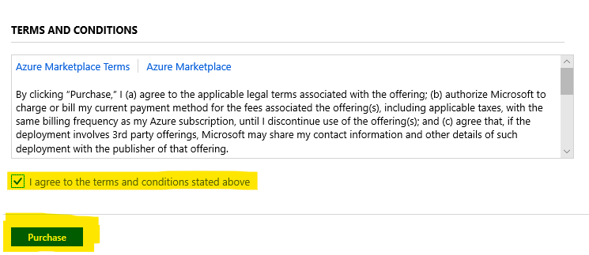
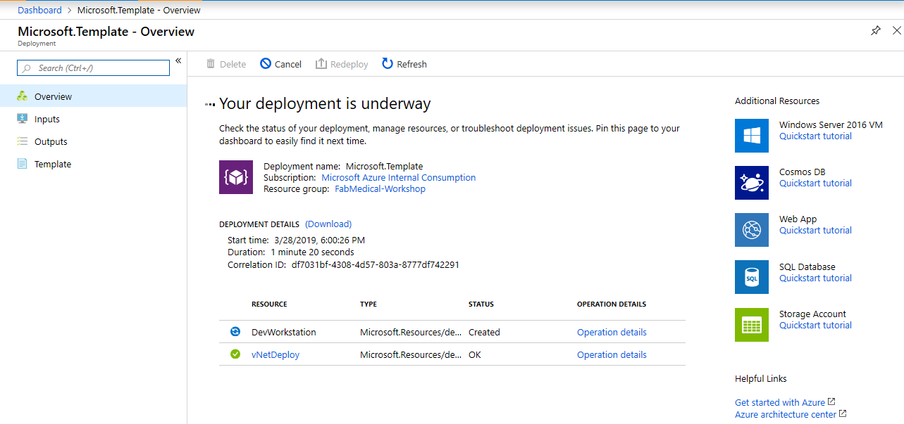
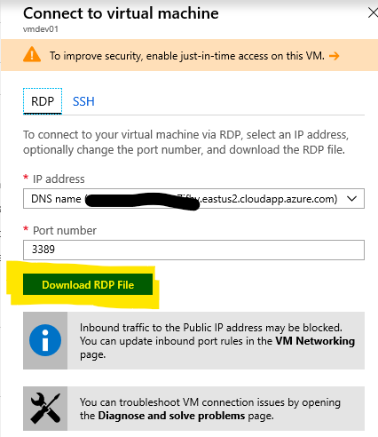
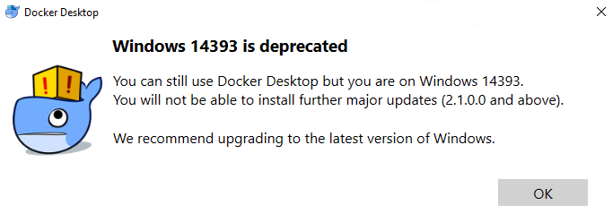

Containers and DevOps

Before the hands-on lab setup guide

March 2019

Information in this document, including URL and other Internet Web site references, is subject to change without notice. Unless otherwise noted, the example companies, organizations, products, domain names, e-mail addresses, logos, people, places, and events depicted herein are fictitious, and no association with any real company, organization, product, domain name, e-mail address, logo, person, place or event is intended or should be inferred. Complying with all applicable copyright laws is the responsibility of the user. Without limiting the rights under copyright, no part of this document may be reproduced, stored in or introduced into a retrieval system, or transmitted in any form or by any means (electronic, mechanical, photocopying, recording, or otherwise), or for any purpose, without the express written permission of Microsoft Corporation.

Microsoft may have patents, patent applications, trademarks, copyrights, or other intellectual property rights covering subject matter in this document. Except as expressly provided in any written license agreement from Microsoft, the furnishing of this document does not give you any license to these patents, trademarks, copyrights, or other intellectual property.

The names of manufacturers, products, or URLs are provided for informational purposes only and Microsoft makes no representations and warranties, either expressed, implied, or statutory, regarding these manufacturers or the use of the products with any Microsoft technologies. The inclusion of a manufacturer or product does not imply endorsement of Microsoft of the manufacturer or product. Links may be provided to third party sites. Such sites are not under the control of Microsoft and Microsoft is not responsible for the contents of any linked site or any link contained in a linked site, or any changes or updates to such sites. Microsoft is not responsible for webcasting or any other form of transmission received from any linked site. Microsoft is providing these links to you only as a convenience, and the inclusion of any link does not imply endorsement of Microsoft of the site or the products contained therein.

© 2018 Microsoft Corporation. All rights reserved.

**Contents**
<!-- TOC -->

- [Containers and DevOps before the hands-on lab setup guide](#containers-and-devops-before-the-hands-on-lab-setup-guide)
  - [Requirements](#requirements)
  - [Provision Dev Workstation in Azure](#provision-dev-workstation-in-azure)
    - [Task 1: Prepare your development environment](#task-1-prepare-your-development-environment)
    - [Task 2: Configure your dev environment](#task-2-configure-your-dev-environment)
  - [Configure your local Windows Machine (Optional)](#configure-your-local-windows-machine-optional)
  - [Configure your local OSX Machine (Optional)](#configure-your-local-osx-machine-optional)

<!-- /TOC -->

# Containers and DevOps before the hands-on lab setup guide

## Requirements

1.  Microsoft Azure subscription must be pay-as-you-go or MSDN.

    - Trial subscriptions will *not* work.

    - You must have rights to create a service principal as discussed in Task 9: Create a Service Principal --- and this typically requires a subscription owner to log in. You may have to ask another subscription owner to login to the portal and execute that step ahead of time if you do not have the rights.

    - You must have enough cores available in your subscription to create the build agent and Azure Kurbernetes Service cluster in Task 5: Create a build agent VM and Task 10: Create an Azure Kubernetes Service cluster. You'll need eight cores if following the exact instructions in the lab, more if you choose additional agents or larger VM sizes. If you execute the steps required before the lab, you will be able to see if you need to request more cores in your sub.

2. A VisualStudio.com account.

3. Local machine or a virtual machine configured with:

    - A browser, preferably Chrome for consistency with the lab implementation tests.

    - Command prompt.

         i.  On Windows, you will be using PowerShell.

         ii. On Mac, all instructions should be executed using bash in Terminal.

4. You will be asked to install other tools throughout the exercises.

>Note: Screen captures may be slightly different as the Azure Portal and Azure DevOps are frequently updated.

## Provision Dev Workstation in Azure

**Duration**: 20min

You should follow all of the steps provided in this section *before* taking part in the hands-on lab ahead of time as some of these steps take time.

### Task 1: Prepare your development environment

You will deploy the development workstation to your azure subscription.  This will create the resource group you will use throughout this lab as well as your development VM.  The ARM template performs the following;
- Creates a virtual network
- Creates a virtual machine
- Installs Hyper-V on the VM
- Installs Docker-Desktop on the VM

1.  Click the 'Deploy to Azure' button

     
    
    This will take you to the Azure Portal, log you in, and show you the custom template deployment screen prompting you for deployment parameters.  **NOTE:** The default user name is "sysadmin" and the default password is "Password$123".

2.  For the **Resource Group**, select to Create New and enter something like "fabmedical-SUFFIX".

    

3.  Check the **I agree to the terms and conditions stated above** checkbox and then click the **Purchase** button.  Deploying the VM should take about 15 minutes.  This is a good time to start reviewing the Hands-on lab step by step documentation.

    

4. Sit back and wait.  It will take about 15-20min to deploy and configure the development environment.  You can monitor the process via the notifications menu option at the top right of the azure portal.

     

    You can get more detail about the deployment by clicking the Deployment Process link.

    

    When your deployment is complete, you can click the link to the resource group to review the services that have been created and remote into your new dev workstation.

    

> **Note: If you experience errors related to lack of available cores, you may have to delete some other compute resources or request additional cores to your subscription and then try this again.**

>**Note: If you plan on using this workstation for an extended period of time, it is recomended that you turn on [just in time access](https://docs.microsoft.com/en-us/azure/security-center/security-center-just-in-time) to your VM and setup an [auto shutdown policy](https://azure.microsoft.com/en-us/blog/announcing-auto-shutdown-for-vms-using-azure-resource-manager/)**

### Task 2: Configure your dev environment

Your development VM is almost ready.  Once you login for the first time, a script will run that will complete the process.  The script will configure the following;
- Install Goggle Chrome
- Install Postman
- Install Azure CLI
- Install Kubernetes CLI
- Install Helm CLI
- Install Visual Studio Code and add several extensions
- Kick off Docker-Desktop
The script should take about 5 minutes to complete.
> 

1.  From the Azure Portal, select the resource group you created when you deployed the template in Task 1 and click on vmdev01.

    

2.  Click connect, download the RDP file, and open the RDP file.
    
    

    

3.  Enter the user name and password you used when you deployed the template.  **Note: choose 'Use a different account' and enter '.\sysadmin' as the user and 'Password$123' as the password if you kept the defaults**

    

    Select 'Yes' on the Remote Desktop Connection Dialog.

    

4.  Once you login, a script will kick off which will install additional tools.

    

5.  When the script is finished, after about 5min, it will launch Docker-Desktop and copy a script to your desktop.  
    >**Note: The script on your desktop can be used if you need to reinstall some of the tools.**  

    Click "OK" in the Docker Desktop dialog that stats support is depricated.  This will start docker on the development machine.

    

    

6. After about 5min You will be prompted to login to Docker.  If you don't have a docker account and don't want to create one, you can simply close the dialog.  Docker is now up and running.
    
    

Your development workstation is now up and running.  The rest of this document is used to setup a local development environment.

## Configure your local Windows Machine (Optional)
To use a local windows Machine, you will need to be running Windows 10 with the Hyper-V feature enabled and have permissions to install software on your machine.  If you are not sure, it is highly recomended that you use the development environment we provision in Azure.  Lastly, depending on your configuration, reboots may be required.

**Duration**: 20min

#Task 1 Configure Hyper-V, Install Docker Desktop
1. Hyper-V
2. Docker Desktop
3. Quick Test

#Task 2 Install Development Tools
1. Visual Studio Code
2. Azure CLI
3. Kubernetes CLI

Your local Windows 10 Machine is now setup for the lab.  The rest of this document is used to setup an OSX based dev environment.

## Configure your local OSX Machine (Optional)
To use a local OSX Machine, you will need to have permissions to install software on your machine.  If you are not sure, it is highly recomended that you use the development environment we provision in Azure.  Lastly, depending on your configuration, reboots may be required.

**Duration**: 20min

#Task 1 Install Docker Desktop
1. Docker Desktop
2. Quick Test

#Task 2 Install Development Tools
1. Visual Studio Code
2. Azure CLI
3. Kubernetes CLI

Your local OSX Machine is now setup for the lab.

You should follow the steps to prep a development environment in Azure or on your local machine prior to starting the Hands-on-Lab.
