<div class="MCWHeader1">
Containers and DevOps
</div>

<div class="MCWHeader2">
Hands-on lab step-by-step
</div>

<div class="MCWHeader3">
November 2018
</div>

Information in this document, including URL and other Internet Web site references, is subject to change without notice. Unless otherwise noted, the example companies, organizations, products, domain names, e-mail addresses, logos, people, places, and events depicted herein are fictitious, and no association with any real company, organization, product, domain name, e-mail address, logo, person, place or event is intended or should be inferred. Complying with all applicable copyright laws is the responsibility of the user. Without limiting the rights under copyright, no part of this document may be reproduced, stored in or introduced into a retrieval system, or transmitted in any form or by any means (electronic, mechanical, photocopying, recording, or otherwise), or for any purpose, without the express written permission of Microsoft Corporation.

Microsoft may have patents, patent applications, trademarks, copyrights, or other intellectual property rights covering subject matter in this document. Except as expressly provided in any written license agreement from Microsoft, the furnishing of this document does not give you any license to these patents, trademarks, copyrights, or other intellectual property.

The names of manufacturers, products, or URLs are provided for informational purposes only and Microsoft makes no representations and warranties, either expressed, implied, or statutory, regarding these manufacturers or the use of the products with any Microsoft technologies. The inclusion of a manufacturer or product does not imply endorsement of Microsoft of the manufacturer or product. Links may be provided to third party sites. Such sites are not under the control of Microsoft and Microsoft is not responsible for the contents of any linked site or any link contained in a linked site, or any changes or updates to such sites. Microsoft is not responsible for webcasting or any other form of transmission received from any linked site. Microsoft is providing these links to you only as a convenience, and the inclusion of any link does not imply endorsement of Microsoft of the site or the products contained therein.

© 2018 Microsoft Corporation. All rights reserved.

Microsoft and the trademarks listed at https://www.microsoft.com/en-us/legal/intellectualproperty/Trademarks/Usage/General.aspx are trademarks of the Microsoft group of companies. All other trademarks are property of their respective owners.

**Contents**

<!-- TOC -->

- [Containers and DevOps hands-on lab step-by-step](#Containers-and-DevOps-hands-on-lab-step-by-step)
  - [Abstract and learning objectives](#Abstract-and-learning-objectives)
  - [Overview](#Overview)
  - [Solution architecture](#Solution-architecture)
  - [Requirements](#Requirements)
  - [Exercise 1: Run and Get to know the App](#Exercise-1-Run-and-Get-to-know-the-App)
    - [Task 1: Run the application](#Task-1-Run-the-application)
    - [Task 2: Review the application architecture](#Task-2-Review-the-application-architecture)
  - [Exercise 2: Publish your containers to a private container registry](#Exercise-2-Publish-your-containers-to-a-private-container-registry)
    - [Task 1: Provision an Azure Container Registry](#Task-1-Provision-an-Azure-Container-Registry)
    - [Task 2: Push the images to the Registry](#Task-2-Push-the-images-to-the-Registry)
  - [Exercise 3: Deploy to Various Container Hosts in Azure](#Exercise-3-Deploy-to-Various-Container-Hosts-in-Azure)
    - [Task 1: Kick Off Infrastructure Provisioning](#Task-1-Kick-Off-Infrastructure-Provisioning)
    - [Task 2: Deploy to ACI](#Task-2-Deploy-to-ACI)
    - [Task 3: Deploy to App Services](#Task-3-Deploy-to-App-Services)
    - [Task 4: Deploy to Kubernetes](#Task-4-Deploy-to-Kubernetes)
  - [Excercise 4: Implement Deployment Pipelines](#Excercise-4-Implement-Deployment-Pipelines)
    - [Task 1: Create Pipeline for ACI Host](#Task-1-Create-Pipeline-for-ACI-Host)
    - [Task 2: Create Pipeline for App Service Host](#Task-2-Create-Pipeline-for-App-Service-Host)
    - [Task 3: Create Pipeline for Kubernetes](#Task-3-Create-Pipeline-for-Kubernetes)
  - [Excercise 5: Instrument the application](#Excercise-5-Instrument-the-application)
    - [Task 1: Instrument content-api](#Task-1-Instrument-content-api)
    - [Task 2: Instrument content-web](#Task-2-Instrument-content-web)
  - [Excercise 6: Instrument the infrastructure](#Excercise-6-Instrument-the-infrastructure)
    - [Task 7: Push images to Azure Container Registry](#Task-7-Push-images-to-Azure-Container-Registry)
  - [Exercise 2: Deploy the solution to Azure Kubernetes Service](#Exercise-2-Deploy-the-solution-to-Azure-Kubernetes-Service)
    - [Task 1: Tunnel into the Azure Kubernetes Service cluster](#Task-1-Tunnel-into-the-Azure-Kubernetes-Service-cluster)
    - [Task 2: Deploy a service using the Kubernetes management dashboard](#Task-2-Deploy-a-service-using-the-Kubernetes-management-dashboard)
    - [Task 3: Deploy a service using kubectl](#Task-3-Deploy-a-service-using-kubectl)
    - [Task 4: Initialize database with a Kubernetes Job](#Task-4-Initialize-database-with-a-Kubernetes-Job)
    - [Task 5: Test the application in a browser](#Task-5-Test-the-application-in-a-browser)
  - [Exercise 3: Scale the application and test HA](#Exercise-3-Scale-the-application-and-test-HA)
    - [Task 1: Increase service instances from the Kubernetes dashboard](#Task-1-Increase-service-instances-from-the-Kubernetes-dashboard)
    - [Task 2: Increase service instances beyond available resources](#Task-2-Increase-service-instances-beyond-available-resources)
    - [Task 3: Restart containers and test HA](#Task-3-Restart-containers-and-test-HA)
  - [Exercise 4: Setup load balancing and service discovery](#Exercise-4-Setup-load-balancing-and-service-discovery)
    - [Task 1: Scale a service without port constraints](#Task-1-Scale-a-service-without-port-constraints)
    - [Task 2: Update an external service to support dynamic discovery with a load balancer](#Task-2-Update-an-external-service-to-support-dynamic-discovery-with-a-load-balancer)
    - [Task 3: Adjust CPU constraints to improve scale](#Task-3-Adjust-CPU-constraints-to-improve-scale)
    - [Task 4: Perform a rolling update](#Task-4-Perform-a-rolling-update)
    - [Task 5: Configure Kubernetes Ingress](#Task-5-Configure-Kubernetes-Ingress)
  - [After the hands-on lab](#After-the-hands-on-lab)

<!-- /TOC -->

# Containers and DevOps hands-on lab step-by-step

## Abstract and learning objectives

This hands-on lab is designed to guide you through the process of deploying Docker images to different container hosts in Azure, deploying with a managed CI/CD pipeline, and instrumenting your solution for better production visibility.

At the end of this lab you will be better able to deploy containerized applications to Azure, understand several container hosting technologies, and understand how to instrument your application and infrastructure.

Technologies used:

- Azure Container Registry
- Azure Container Instances
- Azure App Services
- Azure Kubernetes Services
- Azure DevOps
- Azure Monitor

This workshop is not intended as a containers 101 excersize.  You will not be authoring container images.  You are using a containerized applicatation as way to learn Azure DevOps and Azure.

## Overview

Fabrikam Medical Conferences (FabMedical) provides conference website services tailored to the medical community. They are refactoring their application code, based on node.js, so that it can run as a Docker application, and want to implement a POC that will help them get familiar with the development process, lifecycle of deployment, and a better understanding of their hosting options. They will be deploying their applications to various container hosting services in Azure and using a combination of application and infrastructure monitoring to get more visibility into their application.

In this hands-on lab, you will assist with completing this POC with a subset of the application code base. You will start by running the application locally and getting familiar with its components.  Subsequently you will then deploy the application to several hosting technologies in Azure.  Once the application has been verified to run on the different hosting technologies, you will then create automated CI/CD processes to deploy to those environments.  Lastly you will instrument the application and the environments to provide insights into your applications health.

Time Permitting, there are several advanced scenarios which can be pursued.

> **IMPORTANT: Most Azure resources require unique names. Throughout these steps you will see the word "SUFFIX" or "PREFIX" as part of resource names. You should replace this with your Microsoft email prefix to ensure the resource is uniquely named.**

## Solution architecture

Below is a diagram of the application architecture you will use for this lab. Please study this carefully, so you understand the application your are managing.

The application is written in Node.js and uses MongoDB as its backend datastore.  The application itself has a web frontend which then talks to an API layer which in turn communicates with the Mongo database.  There is also an application used to initialize the MongoDB database.

Each tenant will have the following containers:

- **Conference Web site**: The SPA application that will use configuration settings to handle custom styles for the tenant.

- **Config service**: The API that handles conference configuration settings such as dates, locations, pricing tables, early bird specials, countdowns, and related.

- **Content service**: The API that handles content for the conference such as speakers, sessions, workshops, and sponsors.

## Requirements

1. Microsoft Azure subscription must be pay-as-you-go or MSDN.

    - Trial subscriptions will *not* work.

    - You must have rights to create a service principal as discussed in Task 9: Create a Service Principal --- and this typically requires a subscription owner to log in. You may have to ask another subscription owner to login to the portal and execute that step ahead of time if you do not have the rights.

    - You must have enough cores available in your subscription to create the build agent and Azure Kubernetes Service cluster in Task 5: Create a build agent VM and Task 10: Create an Azure Kubernetes Service cluster. You'll need eight cores if following the exact instructions in the lab, or more if you choose additional agents or larger VM sizes. If you execute the steps required before the lab, you will be able to see if you need to request more cores in your sub.

2. Local machine or a virtual machine configured with:

    - A browser, preferably Chrome for consistency with the lab implementation tests.

    - Command prompts:

        - On Windows, you will be using PowerShell.

        - On Mac, all instructions should be executed using bash in Terminal.

3. You will be asked to install other tools throughout the exercises.

> **VERY IMPORTANT: You should be typing all of the commands as they appear in the guide, except where explicitly stated in this document. Do not try to copy and paste from Word to your command windows or other documents where you are instructed to enter information shown in this document. There can be issues with Copy and Paste from Word that result in errors, execution of instructions, or creation of file content.**


## Exercise 1: Run and Get to know the App

**Duration**: 20 minutes

WHAT: In this exercise, you will run Docker-Compose to build the containers for the application and run the containerized application.  You will then verify the application runs correctly and review the architecture.

WHY:  Docker Compose is being use to deploy all the components together as one application.  This simplifies your app deployment when the app is composed of multiple components.

> **Note**: Complete these tasks from the PowerShell terminal via Visual Studio Code.

### Task 1: Run the application
1. Navigate to c:\source in an explorer window.  Right click on FabMedical and choose to open with Visual Studio Code.

2. Open a Terminal Window in Visual Studio Code and set the default Terminal to PowerShell.
3. Change to the content-deployments directory `cd content-deployments`
4. Type the following command into the terminal window `docker-compose -f docker-compose.yml -f docker-compose.init.yml -p fabmedical up -d`  This will build and run the application containers.  This will take a few moments as it will pull all the containers for the first time and restore all the npm packages for the first time.
5. open Chrome and browse to `http://localhost:3000/speakers.html` to verify the application runs correctly.  You should see a list of speakers and sessions indicating that MongoDb was initialized correctly.

### Task 2: Review the application architecture
1. look at solution (Code): understand how the application code is structured at a high level.
2. look at git structure: Understand that each component is in its own git repo.
3. look at compose file: Understand how the application components work together.
4. look at the docker extension in vscode: understand how the containers are deployed

EXIT CRITERIA: When done with this excersize, the web application should render in the browser and show data from MongoDB.

## Exercise 2: Publish your containers to a private container registry

**Duration**: 30 minutes

WHAT: In this excersize you will provision a container registry and then push the images you built in excersize 1 to that registry

VALUE OF SOMETHING RATHER THAN NOTHING
As you build out your DevOps Practice, when using Containers, a registry plays an important part in that process by providing (XYZ).  You can find plenty of detailed information on each of these capabilities here here and here...

HOW (covers all the tasks)

### Task 1: Provision an Azure Container Registry
1. Provision Azure Container Registry
2. Obtain Keys

### Task 2: Push the images to the Registry
1. Push Image (versioned and latest)
2. Review Container Registry

WHY MSFT
There are multiple features in ACR that are added benefits for cloud based architecures such as (XYZ).  You can get more information here...

## Exercise 3: Deploy to Various Container Hosts in Azure

**Duration**: ?? Minutes

### Task 1: Kick Off Infrastructure Provisioning
1. Create your App Service Service
2. Create your Azure File Share
3. Create your Kubernetes Cluster

### Task 2: Deploy to ACI
1. Deploy Mongo Container and note IP/DNS
2. Deploy API Container and note IP/DNS
3. Deploy Web Container
4. Browse Application

### Task 3: Deploy to App Services

### Task 4: Deploy to Kubernetes

## Excercise 4: Implement Deployment Pipelines
**Duration**: ?? Minutes
### Task 1: Create Pipeline for ACI Host
### Task 2: Create Pipeline for App Service Host
### Task 3: Create Pipeline for Kubernetes

## Excercise 5: Instrument the application

### Task 1: Instrument content-api
1. Setup App Insights
2. Modify Code
3. Deploy
4. Test

### Task 2: Instrument content-web
1. Modify Code
2. Deploy
3. Test


## Excercise 6: Instrument the infrastructure


### Task 7: Push images to Azure Container Registry

To run containers in a remote environment, you will typically push images to a Docker registry, where you can store and distribute images. Each service will have a repository that can be pushed to and pulled from with Docker commands. Azure Container Registry (ACR) is a managed private Docker registry service based on Docker Registry v2.

In this task, you will push images to your ACR account, version images with tagging, and setup continuous integration (CI) to build future versions of your containers and push them to ACR automatically.

1. In the [Azure Portal](https://portal.azure.com/), navigate to the ACR you created in Before the hands-on lab.

2. Select Access keys under Settings on the left-hand menu.

    

3. The Access keys blade displays the Login server, username, and password that will be required for the next step. Keep this handy as you perform actions on the build VM.

    > **NOTE: If the username and password do not appear, select Enable on the Admin user option.**

4. From the WSL session connected to your build VM, login to your ACR account by typing the following command. Follow the instructions to complete the login.

    ```bash
    docker login [LOGINSERVER] -u [USERNAME] -p [PASSWORD]
    ```

    For example:

    ```bash
    docker login fabmedicalsoll.azurecr.io -u fabmedicalsoll -p +W/j=l+Fcze=n07SchxvGSlvsLRh/7ga
    ```

    

    **Tip: Make sure to specify the fully qualified registry login server (all lowercase).**

5. Run the following commands to properly tag your images to match your ACR account name.

    ```bash
    docker tag content-web [LOGINSERVER]/content-web
    docker tag content-api [LOGINSERVER]/content-api
    ```

6. List your docker images and look at the repository and tag. Note that the repository is prefixed with your ACR login server name, such as the sample shown in the screenshot below.

    ```bash
    docker images
    ```

    

7. Push the images to your ACR account with the following command:

    ```bash
    docker push [LOGINSERVER]/content-web
    docker push [LOGINSERVER]/content-api
    ```

    ![In this screenshot of the WSL window, an example of images being pushed to an ACR account results from typing and running the following at the command prompt: docker push \[LOGINSERVER\]/fabmedical/content-web.](media/image67.png)

8. In the Azure Portal, navigate to your ACR account, and select Repositories under Services on the left-hand menu. You will now see two; one for each image.

    

9. Select content-api. You'll see the latest tag is assigned.

    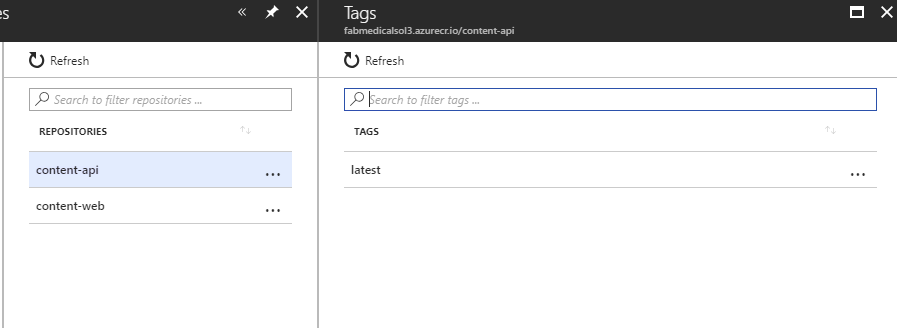

10. From WSL, assign the v1 tag to each image with the following commands. Then list the Docker images to note that there are now two entries for each image; showing the latest tag and the v1 tag. Also note that the image ID is the same for the two entries, as there is only one copy of the image.

    ```bash
    docker tag [LOGINSERVER]/content-web:latest [LOGINSERVER]/content-web:v1
    docker tag [LOGINSERVER]/content-api:latest [LOGINSERVER]/content-api:v1
    docker images
    ```

    

11. Repeat Step 7 to push the images to ACR again so that the newly tagged v1 images are pushed. Then refresh one of the repositories to see the two versions of the image now appear.

    

12. Run the following commands to pull an image from the repository. Note that the default behavior is to pull images tagged with "latest." You can pull a specific version using the version tag. Also, note that since the images already exist on the build agent, nothing is downloaded.

    ```bash
    docker pull [LOGINSERVER]/content-web
    docker pull [LOGINSERVER]/content-web:v1
    ```

13. Next we will use Azure DevOps to automate the process for creating images and pushing to ACR.  First, you need to add an Azure Service Principal to your Azure DevOps account.  Login to your VisualStudio.com account and click the gear icon to access your settings. Then select Services.

14. Choose "+ New Service Endpoint". Then pick "Azure Resource Manager" from the menu.

    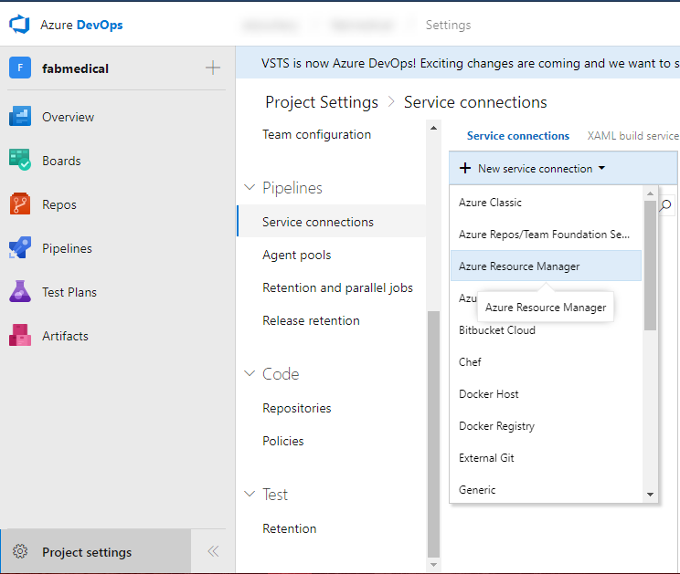


15. Select the link indicated in the screenshot below to access the advanced settings.

    


16. Enter the required information using the service principal information you created before the lab.

    > **Note:** I you don't have your Subscription information handy you can view it using `az account show` on your **local** machine (not the build agent). If you are using pre-provisioned environment, Service Principal is already pre-created and you can use the already shared Service Principal details.

    - **Connection name**: azurecloud-sol

    - **Environment**: AzureCloud

    - **Subscription ID**: `id` from `az account show` output

    - **Subscription Name**: `name` from `az account show` output

    - **Service Principal Client ID**: `appId` from service principal output.

    - **Service Principal Key**: `password` from service principal output.

    - **Tenant ID**: `tenant` from service principal output.

    

17. Select "Verify connection" then select "OK".

    > If the connection does not verify, then recheck and reenter the required data.

18. Now create your first build. Select "Pipelines," then select "+ New definition."

    

19. Choose the content-web repository and accept the other defaults.

    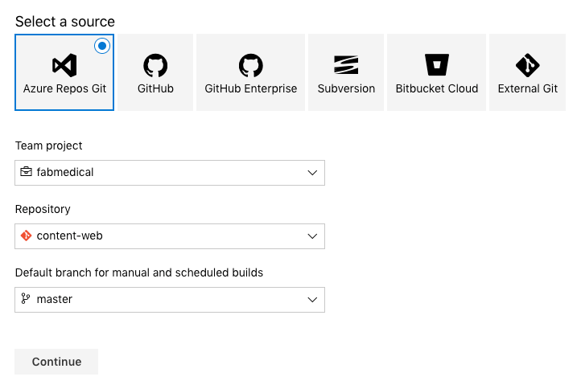

20. Next, search for "Docker" templates and choose "Docker Container" then select "Apply".

    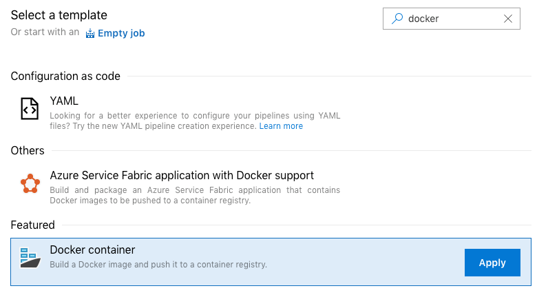

21. Change the build name to "content-web-Container-CI".

    

22. Select "Build an image":

    - **Azure subscription**: Choose "azurecloud-sol".

    - **Azure Container Registry**: Choose your ACR instance by name.

    - **Include Latest Tag**: Checked

    

23. Select "Push an image".

    - **Azure subscription**: Choose "azurecloud-sol".

    - **Azure Container Registry**: Choose your ACR instance by name.

    - **Include Latest Tag**: Checked

    

24. Select "Triggers".

    - **Enable continuous integration**: Checked

    - **Batch changes while a build is in progress**: Checked

    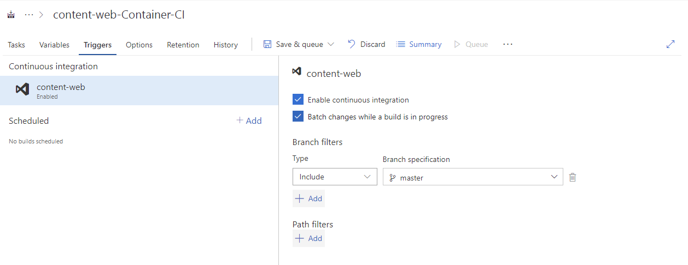


25. Select "Save & queue"; then select "Save & queue" two more times to kick off the first build.

    

26. While that build runs, create the content-api build.  Select "Builds", and then select "+ New".  Configure content-api by following the same steps used to configure content-web.

27. While the content-api build runs, setup one last build for content-init by following the same steps as the previous two builds.

28. Visit your ACR instance in the Azure portal, you should see new containers tagged with the Azure DevOps build number.

    

## Exercise 2: Deploy the solution to Azure Kubernetes Service

**Duration**: 30 minutes

In this exercise, you will connect to the Azure Kubernetes Service cluster you created before the hands-on lab and deploy the Docker application to the cluster using Kubernetes.

### Task 1: Tunnel into the Azure Kubernetes Service cluster

In this task, you will gather the information you need about your Azure Kubernetes Service cluster to connect to the cluster and execute commands to connect to the Kubernetes management dashboard from your local machine.

1. Open your WSL console (close the connection to the build agent if you are connected). From this WSL console, ensure that you installed the Azure CLI correctly by running the following command:

    ```bash
    az --version
    ```

    a.  This should produce output similar to this:

    

    b. If the output is not correct, review your steps from the instructions in Task 11: Install Azure CLI from the instructions before the lab exercises.

2. Also, check the installation of the Kubernetes CLI (kubectl) by running the following command:

    ```bash
    kubectl version
    ```

    a. This should produce output similar to this:

    

    b. If the output is not correct, review the steps from the instructions in Task 12: Install Kubernetes CLI from the instructions before the lab exercises.

3. Once you have installed and verified Azure CLI and Kubernetes CLI, login with the following command, and follow the instructions to complete your login as presented:

    ```bash
    az login
    ```

4. Verify that you are connected to the correct subscription with the following command to show your default subscription:

    ```bash
    az account show
    ```

    a. If you are not connected to the correct subscription, list your subscriptions and then set the subscription by its id with the following commands (similar to what you did in cloud shell before the lab):

    ```bash
    az account list
    az account set --subscription {id}
    ```

5. Configure kubectl to connect to the Kubernetes cluster.

    ```bash
    az aks get-credentials --name fabmedical-SUFFIX --resource-group fabmedical-SUFFIX
    ```

6. Test that the configuration is correct by running a simple kubectl command to produce a list of nodes:

    ```bash
    kubectl get nodes
    ```

    

7. Create an SSH tunnel linking a local port (8001) on your machine to port 80 on the management node of the cluster. Execute the command below replacing the values as follows:

   > **Note: After you run this command, it may work at first and later lose its connection, so you may have to run this again to reestablish the connection. If the Kubernetes dashboard becomes unresponsive in the browser this is an indication to return here and check your tunnel or rerun the command.**

    ```bash
    az aks browse --name fabmedical-SUFFIX --resource-group fabmedical-SUFFIX
    ```

    

8. Open a browser window and access the Kubernetes management dashboard at the Services view. To reach the dashboard, you must access the following address:

    ```bash
    http://localhost:8001
    ```

9. If the tunnel is successful, you will see the Kubernetes management dashboard. 


### Task 2: Deploy a service using the Kubernetes management dashboard

In this task, you will deploy the API application to the Azure Kubernetes Service cluster using the Kubernetes dashboard.

1. From the Kubernetes dashboard, select Create in the top right corner.

2. From the Resource creation view, select Create an App.

    

    - Enter "api" for the App name.

    - Enter [LOGINSERVER]/content-api for the Container Image, replacing [LOGINSERVER] with your ACR login server, such as fabmedicalsol.azurecr.io.

    - Set Number of pods to 1.

    - Set Service to "Internal".

    - Use 3001 for Port and 3001 for Target port.

3. Select SHOW ADVANCED OPTIONS-----

    - Enter 0.125 for the CPU requirement.

    - Enter 128 for the Memory requirement.

    

4. Select Deploy to initiate the service deployment based on the image. This can take a few minutes. In the meantime, you will be redirected to the Overview dashboard. Select the API deployment from the Overview dashboard to see the deployment in progress.

    

5. Kubernetes indicates a problem with the api Replica Set.  Select the log icon to investigate.

    

6. The log indicates that the content-api application is once again failing because it cannot find a mongodb instance to communicate with.  You will resolve this issue by migrating your data workload to CosmosDb.

    

7. Open the Azure portal in your browser and click "+ Create a resource".  Search for "Azure Cosmos DB", select the result and click "Create".

    

8. Configure Azure CosmosDb as follows and click "Review + create" and then click "Create":

    - **Subscription**: Use the same subscription you have used for all your other work.

    - **Resource Group**: fabmedical-SUFFIX

    - **Account Name**: fabmedical-SUFFIX
    
    - **API**: Azure Cosmos DB for MongoDB API

    - **Location**: Choose the same region that you did before.

    - **Geo-redundancy**: Enabled (checked)

    

9. Navigate to your resource group and find your new CosmosDb resource.  Click on the CosmosDb resource to view details.

    
10. Under "Quick Start" select the "Node.js" tab and copy the Node 3.0 connection string.

    

11. Update the provided connection string with a database "contentdb" and a replica set "globaldb".

    > Note: User name and password redacted for brevity.

    ```text
    mongodb://<USERNAME>:<PASSWORD>@fabmedical-sol2.documents.azure.com:10255/contentdb?ssl=true&replicaSet=globaldb
    ```

12. You will setup a Kubernetes secret to store the connection string, and configure the content-api application to access the secret.  First, you must base64 encode the secret value.  Open your WSL window and use the following command to encode the connection string and then, copy the output.


    ```bash
    echo -n "<connection string value>" | base64 -w 0 
    ```

13. Return to the Kubernetes UI in your browser and click "+ Create".  Update the following YAML with the encoded connection string from your clipboard, paste the YAML data into the create dialog and click "Upload".

    ```yaml
    apiVersion: v1
    kind: Secret
    metadata:
        name: mongodb
    type: Opaque
    data:
        db: <base64 encoded value>
    ```

    

14. Scroll down in the Kubernetes dashboard until you can see "Secrets" in the left hand menu.  Click it.

    

15. View the details for the "mongodb" secret.  Click the eyeball icon to show the secret.

    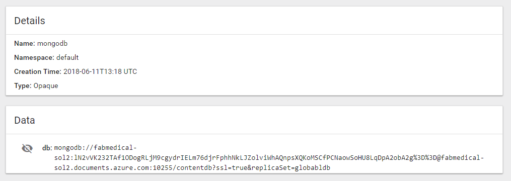

16. Next, download the api deployment configuration using the following command in your WSL window:

    ```bash
    kubectl get -o=yaml --export=true deployment api > api.deployment.yml
    ```

17. Edit the downloaded file:

    ```bash
    vi api.deployment.yml
    ```

       - Add the following environment configuration to the container spec, below the "image" property:

    ```yaml
    - image: fabmedicalsol2.azurecr.io/fabmedical/content-api
      env:
        - name: MONGODB_CONNECTION
          valueFrom:
            secretKeyRef:
              name: mongodb
              key: db
    ```

    

18. Update the api deployment by using `kubectl` to apply the new configuration.

    ```bash
    kubectl apply -f api.deployment.yml
    ```

19. Select "Deployments" then "api" to view the api deployment. It now has a healthy instance and the logs indicate it has connected to mongodb.

    

### Task 3: Deploy a service using kubectl

In this task, deploy the web service using `kubectl`.

1. Open a **new** WSL console.

2. Create a text file called web.deployment.yml using Vim and press the "i" key to go into edit mode.

    ```bash
    vi web.deployment.yml
    <i>
    ```

3. Copy and paste the following text into the editor:

    >**Note: Be sure to copy and paste only the contents of the code block carefully to avoid introducing any special characters. If the code does not paste correctly, you can issue a ":set paste" command before pasting.**

    ```yaml
    apiVersion: extensions/v1beta1
    kind: Deployment
    metadata:
      labels:
          app: web
      name: web
    spec:
      replicas: 1
      selector:
          matchLabels:
            app: web
      strategy:
          rollingUpdate:
            maxSurge: 1
            maxUnavailable: 1
          type: RollingUpdate
      template:
          metadata:
            labels:
                app: web
            name: web
          spec:
            containers:
            - image: [LOGINSERVER].azurecr.io/content-web
              env:
                - name: CONTENT_API_URL
                  value: http://api:3001
              livenessProbe:
                httpGet:
                    path: /
                    port: 3000
                initialDelaySeconds: 30
                periodSeconds: 20
                timeoutSeconds: 10
                failureThreshold: 3
              imagePullPolicy: Always
              name: web
              ports:
                - containerPort: 3000
                  hostPort: 80
                  protocol: TCP
              resources:
                requests:
                    cpu: 1000m
                    memory: 128Mi
              securityContext:
                privileged: false
              terminationMessagePath: /dev/termination-log
              terminationMessagePolicy: File
            dnsPolicy: ClusterFirst
            restartPolicy: Always
            schedulerName: default-scheduler
            securityContext: {}
            terminationGracePeriodSeconds: 30
    ```

4. Edit this file and update the [LOGINSERVER] entry to match the name of your ACR login server.

5. Press the Escape key and type ":wq". Then press the Enter key to save and close the file.

    ```text
    <Esc>
    :wq
    <Enter>
    ```

6. Create a text file called web.service.yml using Vim, and press the "i" key to go into edit mode.

    ```bash
    vi web.service.yml
    ```

7. Copy and paste the following text into the editor:

    >**Note: Be sure to copy and paste only the contents of the code block carefully to avoid introducing any special characters.**

    ```yaml
    apiVersion: v1
    kind: Service
    metadata:
      labels:
          app: web
      name: web
    spec:
      ports:
        - name: web-traffic
          port: 80
          protocol: TCP
          targetPort: 3000
      selector:
          app: web
      sessionAffinity: None
      type: LoadBalancer
    ```

8. Press the Escape key and type ":wq"; then press the Enter key to save and close the file.

9. Type the following command to deploy the application described by the YAML files. You will receive a message indicating the items kubectl has created a web deployment and a web service.

    ```bash
    kubectl create --save-config=true -f web.deployment.yml -f web.service.yml
    ```

    

10. Return to the browser where you have the Kubernetes management dashboard open. From the navigation menu, select Services view under Discovery and Load Balancing. From the Services view, select the web service and from this view, you will see the web service deploying. This deployment can take a few minutes. When it completes you should be able to access the website via an external endpoint.

    

11. Select the speakers and sessions links. Note that no data is displayed, although we have connected to our CosmosDb instance, there is no data loaded. You will resolve this by running the content-init application as a Kubernetes Job.

    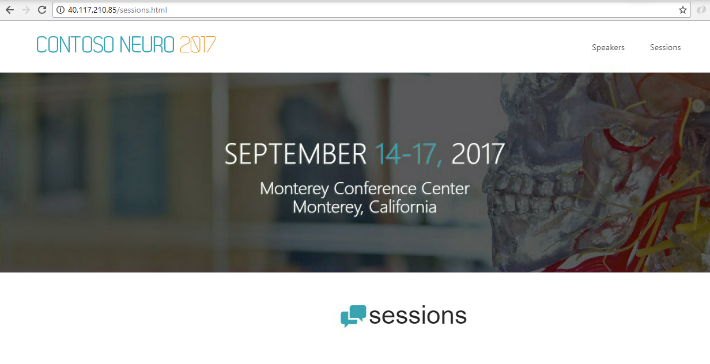

### Task 4: Initialize database with a Kubernetes Job

In this task, you will use a Kubernetes Job to run a container that is meant to execute a task and terminate, rather than run all the time.

1. In your WSL window create a text file called web.service.yml using Vim, and press the "i" key to go into edit mode.

    ```bash
    vi init.job.yml
    ```

2. Copy and paste the following text into the editor:

   > **Note: Be sure to copy and paste only the contents of the code block carefully to avoid introducing any special characters.**

    ```yaml
    apiVersion: batch/v1
    kind: Job
    metadata:
      name: init
    spec:
      template:
        spec:
          containers:
          - name: init
            image: [LOGINSERVER]/content-init
            env:
              - name: MONGODB_CONNECTION
                valueFrom:
                  secretKeyRef:
                    name: mongodb
                    key: db
          restartPolicy: Never
      backoffLimit: 4
    ```

3. Edit this file and update the [LOGINSERVER] entry to match the name of your ACR login server.

4. Press the Escape key and type ":wq". Then press the Enter key to save and close the file.

5. Type the following command to deploy the job described by the YAML. You will receive a message indicating the kubectl has created an init "job.batch".

    ```bash
    kubectl create --save-config=true -f init.job.yml
    ```

6. View the Job by selecting "Jobs" under "Workloads" in the Kubernetes UI.

    

7. Select the log icon to view the logs.

    

8. Next view your CosmosDb instance in the Azure portal and see that it now contains two collections.

    

### Task 5: Test the application in a browser

In this task, you will verify that you can browse to the web service you have deployed and view the speaker and content information exposed by the API service.

1. From the Kubernetes management dashboard, in the navigation menu, select the Services view under Discovery and Load Balancing.

2. In the list of services, locate the external endpoint for the web service and select this hyperlink to launch the application.

    

3. You will see the web application in your browser and be able to select the Speakers and Sessions links to view those pages without errors. The lack of errors means that the web application is correctly calling the API service to show the details on each of those pages.

    

    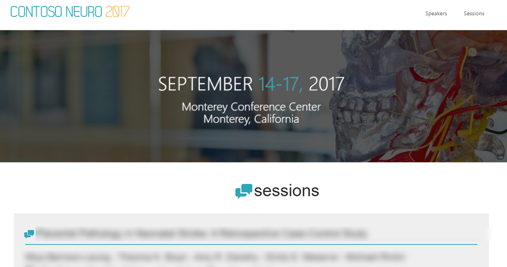

## Exercise 3: Scale the application and test HA

**Duration**: 20 minutes

At this point you have deployed a single instance of the web and API service containers. In this exercise, you will increase the number of container instances for the web service and scale the front end on the existing cluster.

### Task 1: Increase service instances from the Kubernetes dashboard

In this task, you will increase the number of instances for the API deployment in the Kubernetes management dashboard. While it is deploying, you will observe the changing status.

1. From the navigation menu, select Workloads\>Deployments, and then select the API deployment.

2. Select SCALE.

    

3. Change the number of pods to 2, and then select **OK**.

    

    >**Note: If the deployment completes quickly, you may not see the deployment Waiting states in the dashboard as described in the following steps**.

4. From the Replica Set view for the API, you'll see it is now deploying and that there is one healthy instance and one pending instance.

    

5. From the navigation menu, select Deployments from the list. Note that the api service has a pending status indicated by the grey timer icon and it shows a pod count 1 of 2 instances (shown as "1/2").

    

6. From the Navigation menu, select Workloads. From this view, note that the health overview in the right panel of this view. You'll see the following:

    - One deployment and one replica set are each healthy for the api service.

    - One replica set is healthy for the web service.

    - Three pods are healthy.

7. Navigate to the web application from the browser again. The application should still work without errors as you navigate to Speakers and Sessions pages

    - Navigate to the /stats.html page. You'll see information about the environment including:

        - **webTaskId:** The task identifier for the web service instance.

        - **taskId:** The task identifier for the API service instance.

        - **hostName:** The hostname identifier for the API service instance.

        - **pid:** The process id for the API service instance.

        - **mem:** Some memory indicators returned from the API service instance.

        - **counters:** Counters for the service itself, as returned by the API service instance.

        - **uptime:** The up time for the API service.

    - Refresh the page in the browser, and you can see the hostName change between the two API service instances. The letters after "api-{number}-" in the hostname will change.

### Task 2: Increase service instances beyond available resources

In this task, you will try to increase the number of instances for the API service container beyond available resources in the cluster. You will observe how Kubernetes handles this condition and correct the problem.

1. From the navigation menu, select Deployments. From this view, select the API deployment.

2. Configure the deployment to use a fixed host port for initial testing. Select Edit.

    

3. In the Edit a Deployment dialog, you will see a list of settings shown in JSON format. Use the copy button to copy the text to your clipboard.

    

4. Paste the contents into the text editor of your choice (notepad is shown here, MacOS users can use TextEdit).

    

5. Scroll down about half way to find the node "$.spec.template.spec.containers[0]", as shown in the screenshot below.

    ![Screenshot of the deployment JSON code, with the \$.spec.template.spec.containers\[0\] section highlighted.](media/image84.png)

6. The containers spec has a single entry for the API container at the moment. You'll see that the name of the container is "api" - this is how you know you are looking at the correct container spec.

    - Add the following JSON snippet below the "name" property in the container spec:

    ```json
    "ports": [
        {
        "containerPort": 3001,
        "hostPort": 3001
        }
    ],
    ```

    - Your container spec should now look like this:

    ![Screenshot of the deployment JSON code, with the \$.spec.template.spec.containers\[0\] section highlighted, showing the updated values for containerPort and hostPost, both set to port 3001.](media/image85.png)

7. Copy the updated JSON document from notepad into the clipboard. Return to the Kubernetes dashboard, which should still be viewing the "api" deployment.

    - Select Edit.

    

    - Paste the updated JSON document.

    - Select Update.

    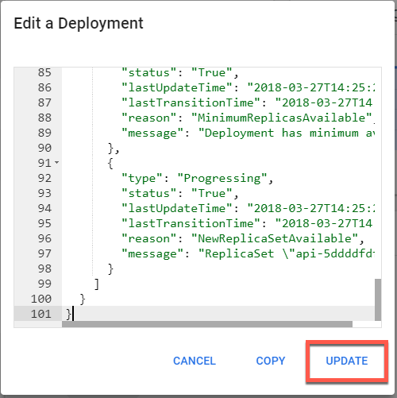

8. From the API deployment view, select **Scale**.

    

9. Change the number of pods to 4 and select **OK**.

    

10. From the navigation menu, select Services view under Discovery and Load Balancing. Select the api service from the Services list. From the api service view, you'll see it has two healthy instances and two unhealthy (or possibly pending depending on timing) instances.

    

11. After a few minutes, select Workloads from the navigation menu. From this view, you should see an alert reported for the api deployment.

    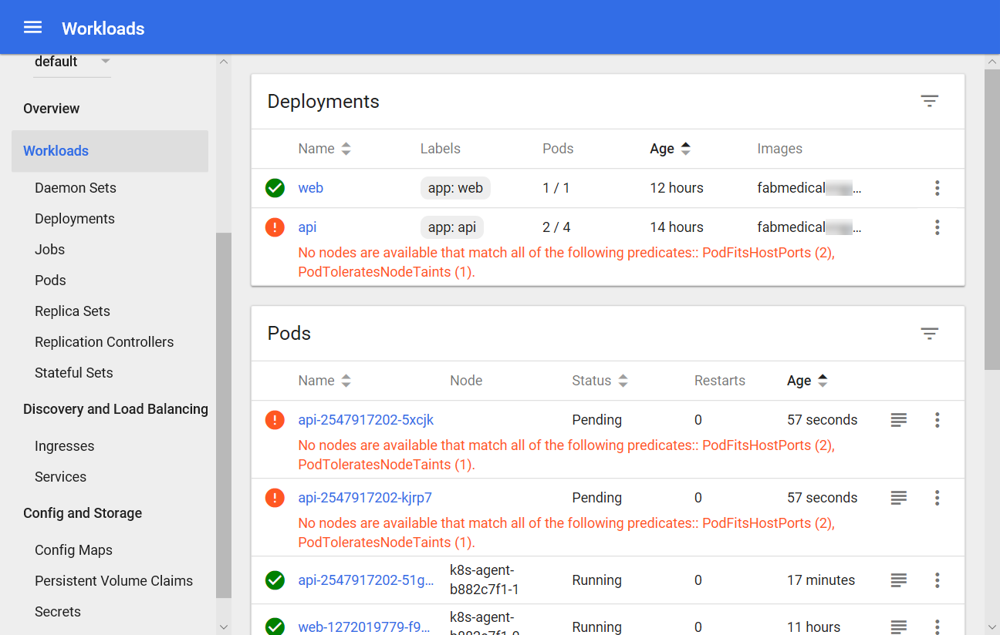

    >**Note: This message indicates that there weren't enough available resources to match the requirements for a new pod instance. In this case, this is because the instance requires port 3001, and since there are only 2 nodes available in the cluster, only two api instances can be scheduled. The third and fourth pod instances will wait for a new node to be available that can run another instance using that port.**

12. Reduce the number of requested pods to 2 using the Scale button.

13. Almost immediately, the warning message from the Workloads dashboard should disappear, and the API deployment will show 2/2 pods are running.

    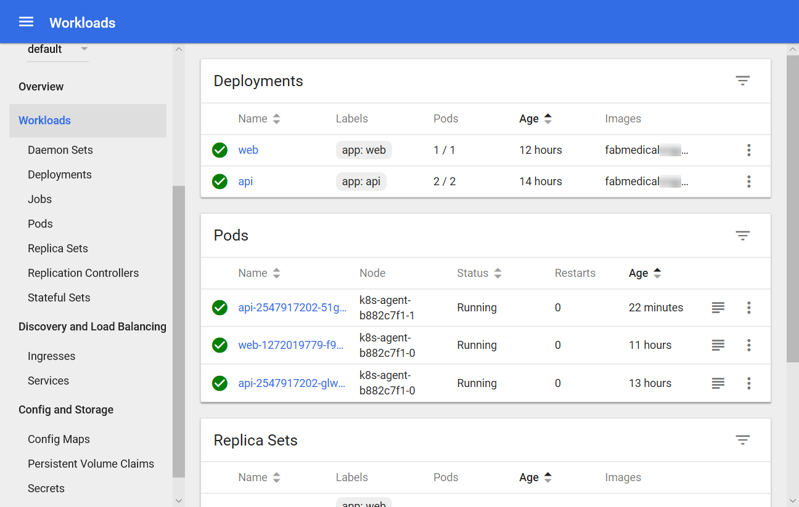

### Task 3: Restart containers and test HA

In this task, you will restart containers and validate that the restart does not impact the running service.

1. From the navigation menu on the left, select Services view under Discovery and Load Balancing. From the Services list, select the external endpoint hyperlink for the web service, and visit the stats page by adding /stats.html to the URL. Keep this open and handy to be refreshed as you complete the steps that follow.

    

    

2. From the navigation menu, select Workloads>Deployments. From Deployments list, select the API deployment.

    

3. From the API deployment view, select **Scale** and from the dialog presented, and enter 4 for the desired number of pods. Select **OK**.

4. From the navigation menu, select Workloads>Replica Sets. Select the api replica set and, from the Replica Set view, you will see that two pods cannot deploy.

    

5. Return to the browser tab with the web application stats page loaded. Refresh the page over and over. You will not see any errors, but you will see the api host name change between the two api pod instances periodically. The task id and pid might also change between the two api pod instances.

    

6. After refreshing enough times to see that the hostName value is changing, and the service remains healthy, return to the Replica Sets view for the API. From the navigation menu, select Replica Sets under Workloads and select the API replica set.

7. From this view, take note that the hostName value shown in the web application stats page matches the pod names for the pods that are running.

    

8. Note the remaining pods are still pending, since there are not enough port resources available to launch another instance. Make some room by deleting a running instance. Select the context menu and choose Delete for one of the healthy pods.

    

9. Once the running instance is gone, Kubernetes will be able to launch one of the pending instances. However, because you set the desired size of the deploy to 4, Kubernetes will add a new pending instance. Removing a running instance allowed a pending instance to start, but in the end, the number of pending and running instances is unchanged.

    

10. From the navigation menu, select Deployments under Workloads. From the view's Deployments list select the API deployment.

11. From the API Deployment view, select Scale and enter 1 as the desired number of pods. Select OK.

    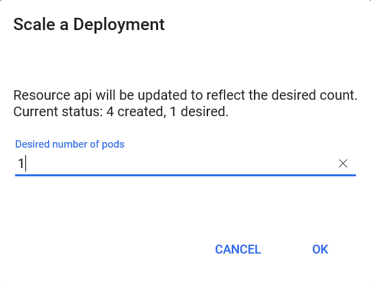

12. Return to the web site's stats.html page in the browser and refresh while this is scaling down. You'll notice that only one API host name shows up, even though you may still see several running pods in the API replica set view. Even though several pods are running, Kubernetes will no longer send traffic to the pods it has selected to scale down. In a few moments, only one pod will show in the API replica set view.

    

13. From the navigation menu, select Workloads. From this view, note that there is only one API pod now.

    

## Exercise 4: Setup load balancing and service discovery

**Duration**: 45 minutes

In the previous exercise we introduced a restriction to the scale properties of the service. In this exercise, you will configure the api deployments to create pods that use dynamic port mappings to eliminate the port resource constraint during scale activities.

Kubernetes services can discover the ports assigned to each pod, allowing you to run multiple instances of the pod on the same agent node --- something that is not possible when you configure a specific static port (such as 3001 for the API service).

### Task 1: Scale a service without port constraints

In this task, we will reconfigure the API deployment so that it will produce pods that choose a dynamic hostPort for improved scalability.

1. From the navigation menu select Deployments under Workloads. From the view's Deployments list select the API deployment.

2. Select Edit.

3. From the Edit a Deployment dialog, do the following:

    - Scroll to the first spec node that describes replicas as shown in the screenshot. Set the value for replicas to 4.

    - Within the replicas spec, beneath the template node, find the "api" containers spec as shown in the screenshot. Remove the hostPort entry for the API container's port mapping.

        

4. Select **Update**. New pods will now choose a dynamic port.

5. The API service can now scale to 4 pods since it is no longer constrained to an instance per node -- a previous limitation while using port 3001.

    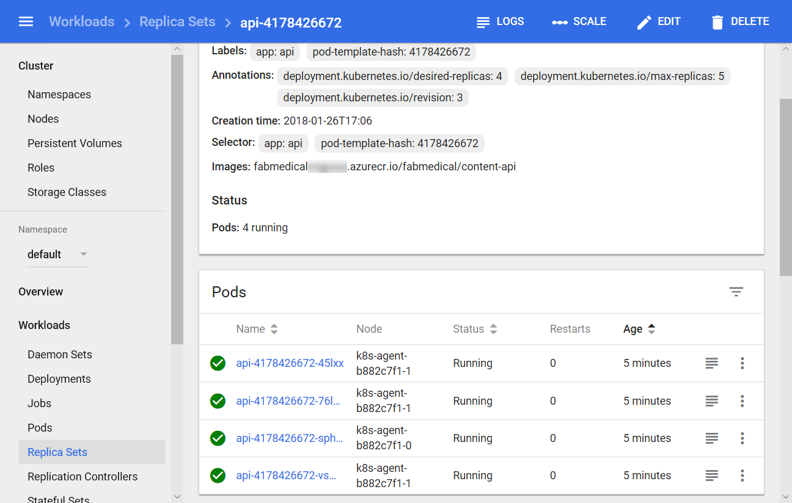

6. Return to the browser and refresh the stats.html page. You should see all 4 pods serve responses as you refresh.

### Task 2: Update an external service to support dynamic discovery with a load balancer

In this task, you will update the web service so that it supports dynamic discovery through the Azure load balancer.

1. From the navigation menu, select Deployments under Workloads. From the view's Deployments list select the web deployment.

2. Select **Edit**.

3. From the Edit a Deployment dialog, scroll to the web containers spec as shown in the screenshot. Remove the hostPort entry for the web container's port mapping.

    

4. Select **Update**.

5. From the web Deployments view, select **Scale**. From the dialog presented enter 4 as the desired number of pods and select **OK**.

6. Check the status of the scale out by refreshing the web deployment's view. From the navigation menu, select Deployments from under Workloads. Select the web deployment. From this view, you should see an error like that shown in the following screenshot.

    

Like the API deployment, the web deployment used a fixed *hostPort*, and your ability to scale was limited by the number of available agent nodes. However, after resolving this issue for the web service by removing the *hostPort* setting, the web deployment is still unable to scale past two pods due to CPU constraints. The deployment is requesting more CPU than the web application needs, so you will fix this constraint in the next task.

### Task 3: Adjust CPU constraints to improve scale

In this task, you will modify the CPU requirements for the web service so that it can scale out to more instances.

1. From the navigation menu, select Deployments under Workloads. From the view's Deployments list select the web deployment.

2. Select **Edit**.

3. From the Edit a Deployment dialog, find the *cpu* resource requirements for the web container. Change this value to "125m".

    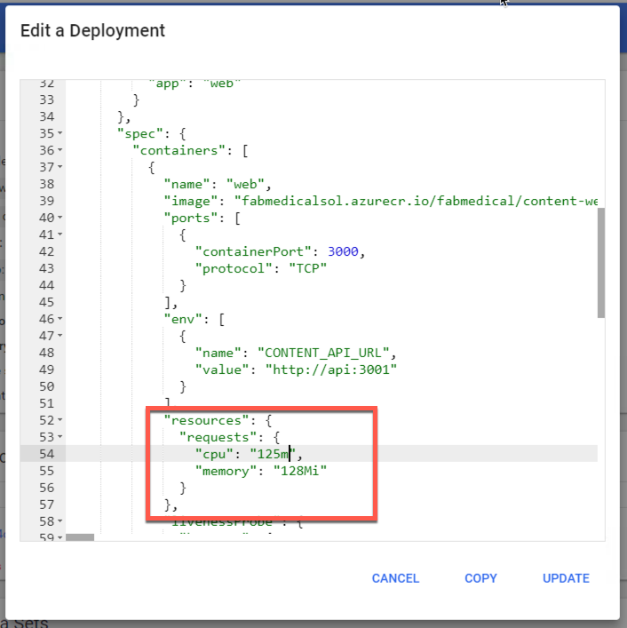

4. Select **Update** to save the changes and update the deployment.

5. From the navigation menu, select Replica Sets under Workloads. From the view's Replica Sets list select the web replica set.

6. When the deployment update completes, four web pods should be shown in running state.

    

7. Return to the browser tab with the web application loaded. Refresh the stats page at /stats.html to watch the display update to reflect the different api pods by observing the host name refresh.

### Task 4: Perform a rolling update

In this task, you will edit the web application source code to add Application Insights and update the Docker image used by the deployment. Then you will perform a rolling update to demonstrate how to deploy a code change.

1. First create an Application Insights key for content-web using the Azure Portal.

2. Select "+ Create a Resource" and search for "Application Insights" and select "Application Insights".

    

3. Configure the resource as follows, then select "Create":

    - **Name**: content-web

    - **Application Type**: Node.js Application

    - **Subscription**: Use the same subscription you have been using throughout the lab.

    - **Resource Group**: Use the existing resource group fabmedical-SUFFIX.

    - **Location**: Use the same location you have been using throughout the lab.

    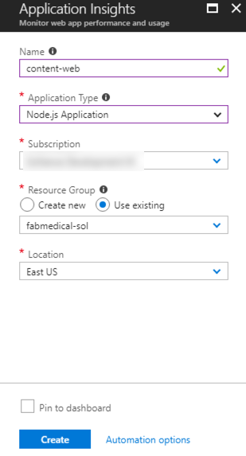

4. While the Application Insights resource for content-web deploys, create a second Application Insights resource for content-api.  Configure the resource as follows, then select "Create":

   - **Name**: content-api

   - **Application Type**: Node.js Application

   - **Subscription**: Use the same subscription you have been using throughout the lab.

   - **Resource Group**: Use the existing resource group fabmedical-SUFFIX.

   - **Location**: Use the same location you have been using throughout the lab.

5. When both resources have deployed, locate them in your resource group.

    

6. Select the content-web resource to view the details.  Make a note of the Instrumentation Key; you will need it when configuring the content-web application.

    

7. Return to your resource group and view the details of the content-api Application Insights resource.  Make a note of its unique Instrumentation Key as well.

8. Connect to your build agent VM using ssh as you did in Task 6: Connect securely to the build agent before the hands-on lab.

9. From the command line, navigate to the content-web directory.

10. Install support for Application Insights.

    ```bash
    npm install applicationinsights --save
    ```

11. Open the server.js file using VI:

    ```bash
    vi server.js
    ```

12. Enter insert mode by pressing `<i>`.

13. Add the following lines immediately after the config is loaded.

    ```javascript
    const appInsights = require("applicationinsights");
    appInsights.setup(config.appInsightKey);
    appInsights.start();
    ```
    

14. Press the Escape key and type ":wq". Then press the Enter key to save and close the file.

    ```text
    <Esc>
    :wq
    <Enter>
    ```

15. Update your config files to include the Application Insights Key.

    ```bash
    vi config/env/production.js
    <i>
    ```

16. Add the following line to the `module.exports` object, and then update [YOUR APPINSIGHTS KEY] with the your Application Insights Key from the Azure portal.

    ```javascript
    appInsightKey: '[YOUR APPINSIGHTS KEY]'
    ```

    

17. Press the Escape key and type ":wq". Then press the Enter key to save and close the file.

18. Now update the development config:
    ```bash
    vi config/env/development.js
    <i>
    ```
19. Add the following line to the `module.exports` object, and then update [YOUR APPINSIGHTS KEY] with the your Application Insights Key from the Azure portal.

    ```javascript
    appInsightKey: '[YOUR APPINSIGHTS KEY]'
    ```
20. Press the Escape key and type ":wq". Then press the Enter key to save and close the file.

21. Push these changes to your repository so that Azure DevOps CI will build a new image while you work on updating the content-api application.

    ```bash
    git add .
    git commit -m "Added Application Insights"
    git push
    ```

22. Now update the content-api application.

    ```bash
    cd ../content-api
    npm install applicationinsights --save
    ```

23. Open the server.js file using VI:

    ```bash
    vi server.js
    ```

24. Enter insert mode by pressing `<i>`.

25. Add the following lines immediately after the config is loaded:

    ```javascript
    const appInsights = require("applicationinsights");
    appInsights.setup(config.appSettings.appInsightKey);
    appInsights.start();
    ```

    

26. Press the Escape key and type ":wq". Then press the Enter key to save and close the file.

    ```text
    <Esc>
    :wq
    <Enter>
    ```

27. Update your config files to include the Application Insights Key.

    ```bash
    vi config/config.js
    <i>
    ```

28. Add the following line to the `exports.appSettings` object, and then update [YOUR APPINSIGHTS KEY] with the your Application Insights Key for **content-api** from the Azure portal.

    ```javascript
    appInsightKey: '[YOUR APPINSIGHTS KEY]'
    ```

    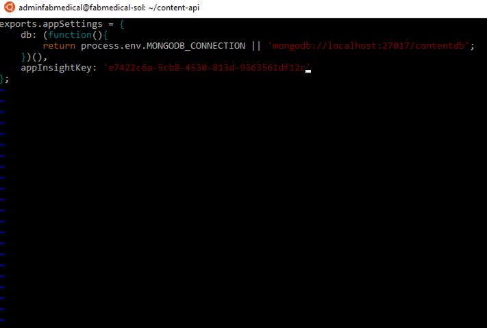

29. Press the Escape key and type ":wq". Then press the Enter key to save and close the file.

30. Push these changes to your repository so that Azure DevOps CI will build a new image.

    ```bash
    git add .
    git commit -m "Added Application Insights"
    git push
    ```

31. Visit your ACR to see the new images and make a note of the tags assigned by Azure DevOps.

     - Make a note of the latest tag for content-web.

        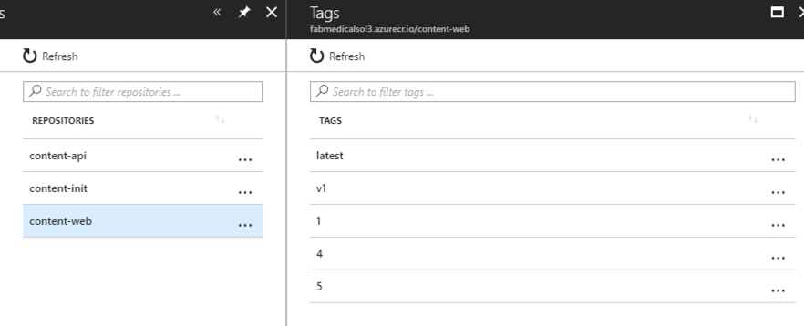

     - And the latest tag for content-api.

        

32. Now that you have finished updating the source code, you can exit the build agent.

    ```bash
    exit
    ```

33. From WSL, request a rolling update using this kubectl command:

    ```bash
    kubectl set image deployment/web web=[LOGINSERVER]/content-web:[LATEST TAG]
    ```

34. Next update the content-api application.

    ```bash
    kubectl set image deployment/api api=[LOGINSERVER]/content-api:[LATEST TAG]
    ```

35. While this update runs, return the Kubernetes management dashboard in the browser.

36. From the navigation menu, select Replica Sets under Workloads. From this view you will see a new replica set for web which may still be in the process of deploying (as shown below) or already fully deployed.

    

37. While the deployment is in progress, you can navigate to the web application and visit the stats page at /stats.html. Refresh the page as the rolling update executes. Observe that the service is running normally and tasks continue to be load balanced.

    

### Task 5: Configure Kubernetes Ingress

In this task you will setup a Kubernetes Ingress to take advantage of path based routing and TLS termination.

1. Install helm, a package manager for Kubernetes.  Run the following commands in your WSL window:

    ```bash
    curl https://raw.githubusercontent.com/kubernetes/helm/master/scripts/get > get_helm.sh
    chmod 700 get_helm.sh
    ./get_helm.sh
    ```

2. Setup your local config and deploy the server side helm component `tiller`.

    ```bash
    helm init
    ```

3. Update your helm package list.

    ```bash
    helm repo update
    ```

4. Install the ingress controller resource to handle ingress requests as they come in.  The ingress controller will receive a public IP of its own on the Azure Load Balancer and be able to handle requests for multiple services over port 80 and 443.

    ```bash
    helm install stable/nginx-ingress --namespace kube-system --set rbac.create=false --set rbac.createRole=false --set rbac.createClusterRole=false
    ```

5. Set a DNS prefix on the IP address allocated to the ingress controller.  Visit the `kube-system` namespace in your kubeneretes dashboard to find the IP.

    http://localhost:8001/#!/service?namespace=kube-system

    

6. Create a script to update the public DNS name for the IP.

    ```bash
    vi update-ip.sh
    <i>
    ```

    Paste the following as the contents and update the IP and SUFFIX values:

    ```bash
    #!/bin/bash

    # Public IP address
    IP="[INGRESS PUBLIC IP]"

    # Name to associate with public IP address
    DNSNAME="fabmedical-[SUFFIX]-ingress"

    # Get the resource-id of the public ip
    PUBLICIPID=$(az network public-ip list --query "[?ipAddress!=null]|[?contains(ipAddress, '$IP')].[id]" --output tsv)

    # Update public ip address with dns name
    az network public-ip update --ids $PUBLICIPID --dns-name $DNSNAME
    ```

    

7. Use `<esc>:wq` to save your script and exit VIM.

8. Run the update script.

    ```bash
    bash ./update-ip.sh
    ```

9. Verify the IP update by visiting the url in your browser.

    >**NOTE:** It is normal to receive a 404 message at this time.

    ```text
    http://fabmedical-[SUFFIX]-ingress.[AZURE-REGION].cloudapp.azure.com/
    ```

    

10. Use helm to install `cert-manager`; a tool that can provision SSL certificates automatically from letsencrypt.org.

    ```bash
    helm install --name cert-manager --namespace kube-system --set rbac.create=false --version v0.5.2 stable/cert-manager
    ```

11. Cert manager will need a custom ClusterIssuer resource to handle requesting SSL certificates.

    ```bash
    vi clusterissuer.yml
    <i>
    ```

    The following resource configuration should work as is:

    ```yaml
    apiVersion: certmanager.k8s.io/v1alpha1
    kind: ClusterIssuer
    metadata:
      name: letsencrypt-prod
    spec:
      acme:
        # The ACME server URL
        server: https://acme-v02.api.letsencrypt.org/directory
        # Email address used for ACME registration
        email: user@example.com
        # Name of a secret used to store theACMEaccount private key
        privateKeySecretRef:
          name: letsencrypt-prod
        # Enable HTTP01 validations
        http01: {}
    ```

12. Save the file with `<esc>:wq`.

13. Create the issuer using kubectl.

    ```bash
    kubectl create --save-config=true -f clusterissuer.yml
    ```

14. Update the cert-manager to use the ClusterIssuer by default.

    ```bash
    helm upgrade cert-manager stable/cert-manager --namespace kube-system --set rbac.create=false --version v0.5.2 --set ingressShim.defaultIssuerName=letsencrypt-prod --set ingressShim.defaultIssuerKind=ClusterIssuer
    ```

15. Now you can create an ingress resource for the content applications.

    ```bash
    vi content.ingress.yml
    <i>
    ```

    Use the following as the contents and update the [SUFFIX] and [AZURE-REGION] to match your ingress DNS name

    ```yaml
    apiVersion: extensions/v1beta1
    kind: Ingress
    metadata:
      name: content-ingress
      annotations:
        kubernetes.io/tls-acme: "true"
        nginx.ingress.kubernetes.io/rewrite-target: /
    spec:
      tls:
      - hosts:
        - fabmedical-[SUFFIX]-ingress.[AZURE-REGION].cloudapp.azure.com
        secretName: tls-secret
      rules:
      - host:   fabmedical-[SUFFIX]-ingress.[AZURE-REGION].cloudapp.azure.com
        http:
          paths:
          - path: /
            backend:
              serviceName: web
              servicePort: 80
          - path: /content-api
            backend:
              serviceName: api
              servicePort: 3001

    ```

16. Save the file with `<esc>:wq`.

17. Create the ingress using kubectl.

    ```bash
    kubectl create --save-config=true -f content.ingress.yml
    ```

18. Refresh the ingress endpoint in your browser.  You should be able to visit the speakers and sessions pages and see all the content.

19. Visit the api directly, by navigating to `/content-api/sessions` at the ingress endpoint.

    

20. Test TLS termination by visiting both services again using `https`.

    > It can take a few minutes before the SSL site becomes avaiable.  This is due to the delay involved with provisioning a TLS cert from letsencypt.

## After the hands-on lab

**Duration**: 10 mins

In this exercise, you will de-provision any Azure resources created in support of this lab.

1. Delete both of the Resource Groups in which you placed all of your Azure resources

    - From the Portal, navigate to the blade of your Resource Group and then select Delete in the command bar at the top.

    - Confirm the deletion by re-typing the resource group name and selecting Delete.

2. Delete the Service Principal created on Task 9: Create a Service Principal before the hands-on lab.

    ```bash
    az ad sp delete --id "Fabmedical-sp"
    ```

You should follow all steps provided *after* attending the Hands-on lab.
